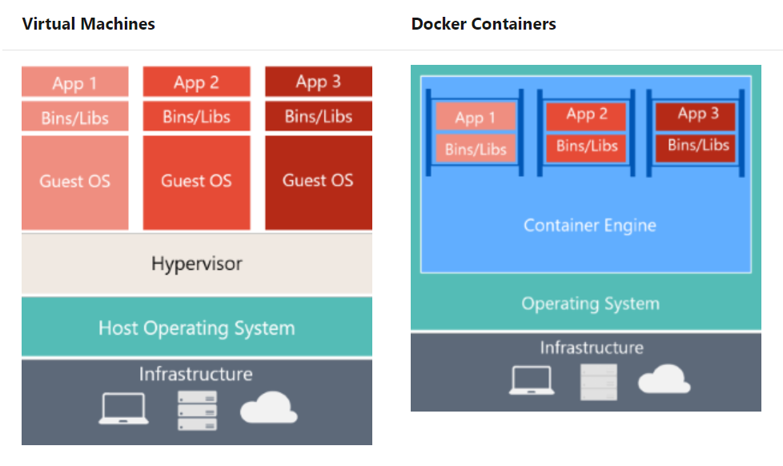

# Kubernetes Fundamentals

Support for Kubernetes Fundamentals presentation

## Containers vs Virtual Machines



*Source: [Microsoft Docs](https://docs.microsoft.com/en-us/dotnet/architecture/microservices/container-docker-introduction/docker-defined)*

## Docker Basics

### Basic taxonomy


*Source: [Microsoft Docs](https://docs.microsoft.com/en-us/dotnet/architecture/microservices/container-docker-introduction/docker-containers-images-registries)*

### Client/Server architecture

```bash
docker version
```

```console
Client: Docker Engine - Community
 Version:           19.03.3
 API version:       1.40
 Go version:        go1.12.10
 Git commit:        a872fc2f86
 Built:             Tue Oct  8 00:59:59 2019
 OS/Arch:           linux/amd64
 Experimental:      false

Server: Docker Engine - Community
 Engine:
  Version:          19.03.2
  API version:      1.40 (minimum version 1.12)
  Go version:       go1.12.8
  Git commit:       6a30dfc
  Built:            Thu Aug 29 05:32:21 2019
  OS/Arch:          linux/amd64
  Experimental:     false
 containerd:
  Version:          v1.2.6
  GitCommit:        894b81a4b802e4eb2a91d1ce216b8817763c29fb
 runc:
  Version:          1.0.0-rc8
  GitCommit:        425e105d5a03fabd737a126ad93d62a9eeede87f
 docker-init:
  Version:          0.18.0
  GitCommit:        fec3683
```

Notes:

- client / server architecture
- docker daemon: server part of docker, run on the host where the container will be running
- docker client: could be any machine from your laptop, to a vm or the same machine that runs the deamon

### Run your first container

```bash
docker run hello-docker
```

```console
Unable to find image 'hello-world:latest' locally
latest: Pulling from library/hello-world
1b930d010525: Pull complete 
Digest: sha256:c3b4ada4687bbaa170745b3e4dd8ac3f194ca95b2d0518b417fb47e5879d9b5f
Status: Downloaded newer image for hello-world:latest

Hello from Docker!
This message shows that your installation appears to be working correctly.

To generate this message, Docker took the following steps:
 1. The Docker client contacted the Docker daemon.
 2. The Docker daemon pulled the "hello-world" image from the Docker Hub.
    (amd64)
 3. The Docker daemon created a new container from that image which runs the
    executable that produces the output you are currently reading.
 4. The Docker daemon streamed that output to the Docker client, which sent it
    to your terminal.

To try something more ambitious, you can run an Ubuntu container with:
 $ docker run -it ubuntu bash

Share images, automate workflows, and more with a free Docker ID:
 https://hub.docker.com/

For more examples and ideas, visit:
 https://docs.docker.com/get-started/
```

Notes:

- Docker is based on layered image that contains everything that is needed to run your application
- When running a container with `docker run` command, the first task is to ensure the Docker image is downloaded locally on the Docker host
- Then, the container is ran
- Docker image = binary that represents your application
- Docker container = instance of your application

### Basic Docker commands

```bash
# List images available on the host
docker images

# List the running container on the host
docker ps

# List all containers on the host (running or stopped/failed)
docker ps -a

# Stop a container
docker stop CONTAINER_ID

# Start an existing but stopped container
docker start CONTAINER_ID

# Pull an image from a Docker registry
docker pull IMAGE_NAME:TAG

# Login to a Docker registry
docker login

# Build a container from a Docker file
docker build -t IMAGE_NAME:TAG ./Dockerfile

# Push a Docker image
docker push IMAGE_NAME:TAG
```

### What is a Dockerfile

It's nothing more than a text file that contains the receipe defining how to build the Docker image that will be used to run your application as a Docker container.

```Dockerfile
FROM mcr.microsoft.com/dotnet/core/sdk:2.2 AS build-env
WORKDIR /app

# Copy csproj and restore as distinct layers
COPY *.csproj ./
RUN dotnet restore

# Copy everything else and build
COPY . ./
RUN dotnet publish -c Release -o out

# Build runtime image
FROM mcr.microsoft.com/dotnet/core/aspnet:2.2
WORKDIR /app
COPY --from=build-env /app/out .
ENTRYPOINT ["dotnet", "aspnetapp.dll"]
```

Notes:

- multi-staged build allow to use a full SDK to build the application, but produce a lighter final image that contains only the runtime to run the application.

## Kubernetes Basics

### Why Kubernetes

Docker is sufficient to work locally on your machine, in development environment or to run a few containers workload, but when it comes to putting complex applications in production (like microservices application), you definitely need an orchestrator that helps you with scheduling and monitoring everything for you!

You can see Kubernetes as a distributed OS / Kernel. It will expose a pool (or multiple pools) of machines (physical or virtual) as a single set of resources (CPU & Memory) that can run your applications.

### Cluster Architecture

#### Master & Nodes


*Source: [Microsoft Docs](https://docs.microsoft.com/en-us/azure/aks/concepts-clusters-workloads)*

#### Node


*Source: [Microsoft Docs](https://docs.microsoft.com/en-us/azure/aks/concepts-clusters-workloads)*

Find more in [the documentation](https://docs.microsoft.com/fr-fr/azure/aks/concepts-clusters-workloads).

### Basic Kubernetes Objects

Kubernetes Objects are persistent entities in the Kubernetes system. Kubernetes uses these entities to represent the state of your cluster.

Kubernetes comes with built-in simple objects:

- **Pod**: the smallest unit of execution on Kubernetes - can contain multiple containers, all co-located on the same host and sharing the same resources (network, storage, etc...)
- **Service**: allows to expose an application as a network service - by default each pod get an IP address on the cluster, but when you have multiple pods (scaling) services allow to discover (through DNS) and load balancer traffic between pods
- **Volume**: an abstraction that allows to get a persistent storage available for a given pod
- **Namespace**: a way to group Kubernetes objects inside a logical entity - coupled with RBAC / Network Policies, it's a good way to isolate multiple applications running in the same cluster

More complex objects allow Kubernetes to automatically control what is running in your cluster:

- **Deployment**: define the desired state to maintain for a replica set or pods (like "I always want 3 pods of this application up & running)
- **DeamonSet**: ensure that a pod runs on each node that is part of the cluster
- **StatefulSet**: used for stateful application - same idea than a deployment but maintaining a sticky identity for each pod
- **ReplicaSet**: maintains a stable state of replica pods running at a given time
- **Job**: run one or more pods and make sure they terminate successfuly

Find more in the [official Kubernetes documentation](https://kubernetes.io/docs/concepts/overview/working-with-objects/kubernetes-objects/).

### Create an Azure Kubernetes Cluster

Can be done in multiple ways:

- Azure Portal
- Azure CLI
- Azure Resource Manager
- Terraform
- Etc.

Using Azure CLI to create a simple 2 nodes Kubernetes 1.15.3 cluster:

```bash
az group create -n aksjcofr-rg -l francecentral

az aks create -n aksjcofr -g aksjcofr-rg \
    --kubernetes-version 1.15.3 \
    --node-count 2 \
    --generate-ssh-keys \
    --service-principal $SPN_CLIENT_ID \
    --client-secret $SPN_CLIENT_SECRET
```

After few minutes, your cluster is available to you.

### Get starte with Kubernetes on Azure

Download the cluster credentials:

```bash
az aks get-credentials -n aksjcofr -g aksjcofr-rg
```

Download the Kubernetes CLI (kubectl):

```bash
az aks install-cli
```

Connect to your new Kubernetes cluster and execute basic commands:

```bash
# get local configuration
kubectl config view
kubectl config current-context

# get current context cluster info
kubectl cluster-info

# retrieve the list of nodes
kubectl get nodes

# retrieve the list of pods already running in the cluster
kubectl get pods --all-namespaces

# retrieve all resources created in all namespaces
kubectl get all --all-namespaces

# scope to a given namespace
kubectl get all -n kube-system
```

### Run a simple pod

Using `kubectl`

```bash
kubectl run -i --rm --tty busybox --image=busybox --generator=run-pod/v1 -- sh
```

Using a YAML object definition:

```yaml
apiVersion: v1
kind: Pod
metadata:
  name: busybox-sleep
spec:
  containers:
  - name: busybox
    image: busybox
    args:
    - sleep
    - "1000000"
```

```bash
kubectl apply -f busybox.yaml
```

### Using a deployment

nginx-deployment.yaml:

```YAML
apiVersion: apps/v1 # for versions before 1.9.0 use apps/v1beta2
kind: Deployment
metadata:
  name: nginx
spec:
  strategy:
    type: Recreate
  selector:
    matchLabels:
      app: nginx
  replicas: 3 # tells deployment to run 1 pods matching the template
  template: # create pods using pod definition in this template
    metadata:
      labels:
        app: nginx
    spec:
      containers:
      - name: nginx
        image: nginx
        ports:
        - containerPort: 80
```

Notes:

- show that when you kill a pod that is part of a deployment, the deployment controller will create a new one to ensure that the number of replicas is always satisfied.

### Exposing a service

Using `kubectl`:

```bash
kubectl expose deployment nginx --port=80 --target-port=80
```

Using a YAML service definition:

```YAML
apiVersion: v1
kind: Service
metadata:
  name: nginx
  namespace: default
  labels:
    app: nginx
spec:
  externalTrafficPolicy: Local
  ports:
  - name: http
    port: 80
    protocol: TCP
    targetPort: 80
  selector:
    app: nginx
  type: LoadBalancer
```

```bash
kubectl apply -f nginx-service.yaml
watch kubectl get service
```